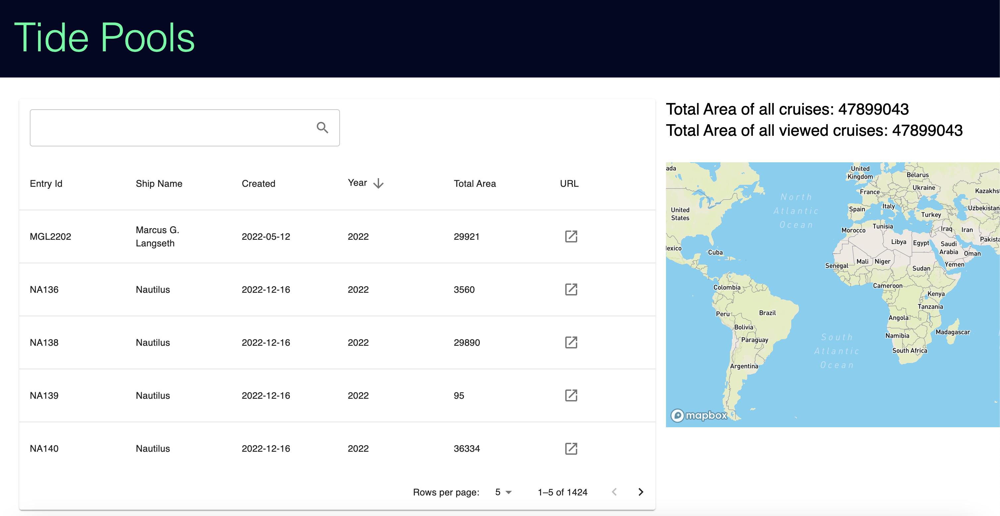

# Tide-Pool :ocean:

## About

Tide-pool is a sandbox BRX project, built in [Typescript 4.9](https://www.typescriptlang.org) using [React 18](https://reactjs.org/).

**Noteworthy Tooling Included:**

- [Vite](https://github.com/vitejs) - Build tool and dev server
- [Redux-Toolkit](https://redux-toolkit.js.org/) - React/Redux State Management
- [TailwindCSS](https://tailwindcss.com) - CSS utilities
- [React-Map-GL](https://visgl.github.io/react-map-gl/) - React Wrapper for [Mapbox-GL](https://docs.mapbox.com/mapbox-gl-js)

## Developing

The project requires Node 18 to be installed on your local machine, refer to npm for [download instructions](https://docs.npmjs.com/downloading-and-installing-node-js-and-npm).

1. Install project dependencies

   ```sh
   npm install
   ```

2. API Key Setup

   To access the map feature in Tide Pools, you need an API key. Follow these steps to set it up:

   1. Sign up or log in to your account at [MapBox](https://account.mapbox.com/access-tokens/).
   2. Navigate to the API section.
   3. Generate a new API key.
   4. Copy the generated API key.
   5. Insert the API key into the .env file using the following format:

      ```bash
      VITE_MAPBOX_API_KEY = "YOUR_API_KEY_HERE"

      ```

3. Start the Dev Server

   ```sh
   npm run dev
   ```

The dev server will launch in your browser at [localhost:4444](localhost:4444) and will automatically reload as you make changes.

## Notes

- Clicking on a row will make the map "fly to" the center coordinates of the survey

  
